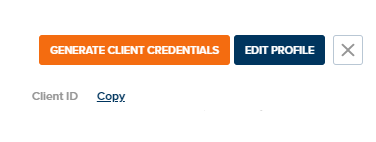
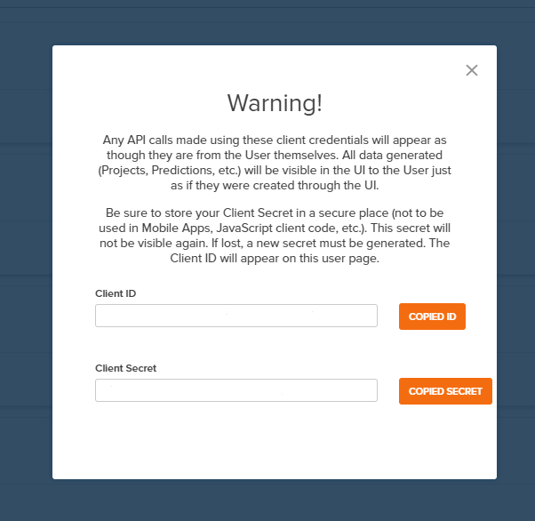

.. _authentication_oauth2:

#######################
Authentication (OAuth2)
#######################

PlantPredict uses the `OAuth 2.0 <https://oauth.net/2/>`_ authorization protocol for administering and managing
access tokens. If you are a first time user of the PlantPredict API, you need a set of client credentials (client
ID and client secret). The way in which you generate/receive your client credentials depends on the scenario.

Step 1: Generate/receive client ID and client secret.
======================================================

"I have never used PlantPredict and need an account".
------------------------------------------------------

Email **support@plantpredict.com** and request a PlantPredict account. Provide some information about yourself and your
organization. Mention that you are interested in using the PlantPredict API via the Python SDK. Once you have an
account, refer to the two options below for generating client credentials.

"I have a PlantPredict account and am the company administrator."
------------------------------------------------------------------

If you are the only person with a PlantPredict account in your organization/company, or the first person to have an
account, you are likely the company admin. If you are a company admin, you will have a gear icon next to your
name on the very bottom-left of the page when you log in on a web browser.

.. image:: _images/company_admin_gear.png
    :align: center

Click the gear icon. On the next page, search for the name of the person you would like to generate client credentials
for, and click on their name.

.. image:: _images/search_for_name.png
    :align: center

Click on "Generate Client Credentials" on the top right of the next page.

Copy the Client ID and Client Secret to your clipboard to be pasted into :file:`plantpredict.settings` in step 2.

"I have a PlantPredict account but am not the company administrator."
---------------------------------------------------------------------

Contact the person in your organization who is the company admin, and provide to them a link to this page.

Step 2: Paste your client credentials into the settings.py file.
==========================================================================

Paste the client ID and client secret into :file:`plantpredict.settings`.

.. code-block:: python

    # SETTINGS.PY FILE - MANUALLY ENTER IN CLIENT_ID AND CLIENT_SECRET.
    # TOKEN IS STORED HERE ONCE GENERATED.

    BASE_URL = "https://api.plantpredict.com/"

    CLIENT_ID = "INSERT CLIENT ID HERE"
    CLIENT_SECRET = "INSERT CLIENT SECRET HERE"

    TOKEN = ""

Step 3: Authenticate and receive a token.
=========================================

Execute the following code to authenticate and receive an access token.

.. code-block:: python

    import plantpredict

    plantpredict.OAuth2.token(
        client_id=plantpredict.settings.CLIENT_ID, client_secret=plantpredict.settings.CLIENT_SECRET
    )

This code will automatically assign the generated access token to the TOKEN variable in
:file:`plantpredict.settings`. Every API call you make after this step will automatically reference
the access token and authenticate without any additional client-side code.

.. warning::

    The access token will expire after 1 hour. The current version of the SDK does not include any functionality
    to handle refreshing the token. While this feature is under development, if your code takes longer than an
    hour to execute, consider any novel solution to generate a new token before it expires.